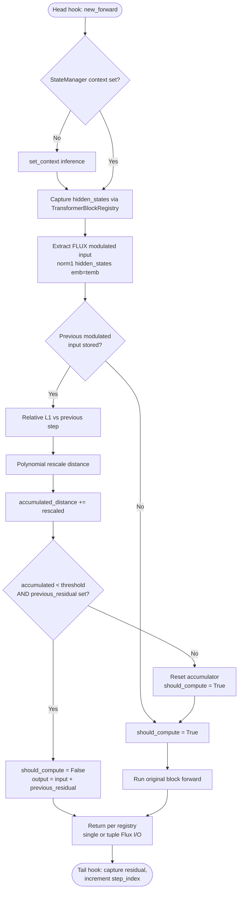

# Requirements: TeaCache for FLUX

## Summary

Add a named **TeaCache** inference cache for **FLUX** transformers, implemented as a self-contained hook module (`src/diffusers/hooks/teacache.py`) that follows the MagCache head/tail block-hook scaffold. TeaCache uses the paper-faithful skip metric — polynomial-rescaled relative L1 distance on timestep-modulated block input, accumulated across denoising steps — and reuses cached full-stack residuals on skip (`input + previous_residual`, same reuse shape as MagCache). Wire `TeaCacheConfig` and `apply_teacache()` through `CacheMixin.enable_cache()` / `disable_cache()`, register in the public API, and validate with unit hook tests plus `FluxTransformer2DModel` integration tests. This closes [#12589](https://github.com/huggingface/diffusers/issues/12589) without landing [PR #12652](https://github.com/huggingface/diffusers/pull/12652) as-is.

## Problem Frame

Diffusers already ships several training-free inference caches (`FirstBlockCache`, `MagCache`, `FasterCache`, TaylorSeer) under `CacheMixin.enable_cache()`, but **TeaCache** — the technique from [2411.19108](https://huggingface.co/papers/2411.19108) — is not yet available as a first-class, named cache. `FirstBlockCache` cites TeaCache as inspiration yet implements a simpler model-agnostic heuristic (first-block residual delta); it is not algorithmically equivalent. Issue #12589 requests TeaCache integration; contributor PR #12652 adds four models via transformer-root forward interception, which conflicts with maintainer guidance to keep model forwards in model files and use standalone hook utilities keyed by class name. Users who want TeaCache's modulated-input skip policy on FLUX today have no supported path in diffusers.

## Key Decisions

- **Block-level hooks (MagCache pattern), not root forward interception.** Head hook decides skip and replays residuals; middle/tail hooks pass through or capture residuals. No copied `FluxTransformer2DModel.forward()` in the hook layer (`mag_cache.py:171-441` is the structural prior).

- **Standalone functions keyed by class name.** Per-model configuration lives in a `_MODEL_CONFIG` map (polynomial coefficients, modulated-input extractor). No adapter indirection — aligns with DN6 feedback on PR #12652.

- **FLUX-only v1.** Ship FLUX polynomial coefficients and a FLUX modulated-input extractor (`FluxTransformerBlock.norm1(hidden_states, emb=temb)` at the head block, `transformer_flux.py:445`). Unsupported model classes raise `ValueError` at `apply_teacache()`.

- **True TeaCache skip metric, not MagCache ratios or FirstBlockCache residual delta.** Replace MagCache's `mag_ratios` budget with polynomial-rescaled modulated-input relative L1 accumulation vs threshold. Reuse mechanism stays MagCache-shaped.

- **No `# Copied from` chain.** Structure is borrowed from MagCache; implementation is a fresh file without verbatim copy headers.

- **Single-file hook module.** `hooks/teacache.py` (~300–400 LOC), not a `hooks/teacache/` subpackage and not a wrapper delegating to MagCache.

## Key Flows

### Skip decision (head block, each denoising step)

At the first transformer block in walk order (`transformer_blocks` then `single_transformer_blocks` via `_ALL_TRANSFORMER_BLOCK_IDENTIFIERS`), the head hook:

1. Ensures inference `StateManager` context is active.
2. Captures block `hidden_states` input via `TransformerBlockRegistry` metadata.
3. Extracts FLUX modulated input from the head block (norm1 with `temb`).
4. Computes relative L1 distance vs the previous step's modulated input; applies model-specific polynomial rescaling; accumulates.
5. If accumulated distance is below `threshold` and a `previous_residual` exists, sets `should_compute = False` and returns `input + previous_residual` (with MagCache-compatible shape handling for tuple Flux I/O and text+image concatenation).
6. Otherwise runs the block forward; tail hook updates `previous_residual` and advances step index.

### Enable / disable lifecycle

1. User calls `model.enable_cache(TeaCacheConfig(...))` on a `CacheMixin` model.
2. `cache_utils.py` dispatches to `apply_teacache(model, config)`.
3. `apply_teacache` walks `_ALL_TRANSFORMER_BLOCK_IDENTIFIERS`, registers head hook on first block and block/tail hooks on remaining blocks (same walk as `apply_mag_cache`, `mag_cache.py:397-441`).
4. `disable_cache()` removes TeaCache leader and block hooks by name and clears `_cache_config`.

## Requirements

- **R-1** — Export `TeaCacheConfig` and `apply_teacache` from the diffusers public API (`src/diffusers/hooks/__init__.py` and top-level `src/diffusers/__init__.py`), matching the registration pattern used for `MagCacheConfig` / `apply_mag_cache`.

- **R-2** — `CacheMixin.enable_cache()` accepts `TeaCacheConfig` and dispatches to `apply_teacache`; `disable_cache()` removes TeaCache hooks (`_TEACACHE_LEADER_BLOCK_HOOK`, `_TEACACHE_BLOCK_HOOK` or equivalent stable names) and clears state. Double-enable raises the same `ValueError` as other caches.

- **R-3** — v1 supports **FLUX only**: `_MODEL_CONFIG` (or equivalent) maps `FluxTransformer2DModel` (and its block class) to FLUX polynomial coefficients and a modulated-input extractor. Any other model class passed to `apply_teacache` raises `ValueError` with a clear unsupported-model message.

- **R-4** — Skip decision implements **true TeaCache metric**: at each step, extract modulated input at the head block; compute relative L1 distance vs the previous step; apply model-specific polynomial rescaling; accumulate across steps; skip when accumulated distance is below `TeaCacheConfig.threshold`. This logic must not reuse MagCache `mag_ratios` or FirstBlockCache residual-delta heuristics.

- **R-5** — On skip, the head hook replays the cached full-stack residual as **`output = input + previous_residual`**, including MagCache-compatible handling for shape mismatches (text+image concatenation) and tuple return paths (`return_hidden_states_index` / `return_encoder_hidden_states_index` via `TransformerBlockRegistry`).

- **R-6** — Hook registration walks **`_ALL_TRANSFORMER_BLOCK_IDENTIFIERS`**, covering both `transformer_blocks` and `single_transformer_blocks` on FLUX. Head hook on the first block in combined walk order; tail hook on the last block; pass-through block hooks on middle blocks — same topology as `apply_mag_cache`.

- **R-7** — Unit tests in `tests/hooks/test_teacache.py` mirror `tests/hooks/test_mag_cache.py`: dummy transformer with registered blocks; assertions for skip vs compute paths; tuple Flux-style I/O; step reset at end of inference loop; hook re-application idempotency.

- **R-8** — Model integration test **`TestFluxTransformerTeaCache`** in `tests/models/transformers/test_models_transformer_flux.py`, using a new **`TeaCacheTesterMixin`** in `tests/models/testing_utils/cache.py` (parallel to `MagCacheTesterMixin`): enable/disable state, hook registration, inference smoke, context manager, stateful reset.

- **R-9** — Documentation updates distinguish TeaCache from **FirstBlockCache** (TeaCache-inspired but different skip signal) and **MagCache** (same residual reuse shape, different skip policy): `docs/source/en/optimization/cache.md` optimization guide with FLUX `enable_cache(TeaCacheConfig(...))` example; `docs/source/en/api/cache.md` autodoc entries for `TeaCacheConfig` and `apply_teacache`.

## Change-Impact

| Action | Path | Notes |
|--------|------|-------|
| CREATE | `src/diffusers/hooks/teacache.py` | ~300–400 LOC; config, state, head/tail hooks, `apply_teacache`, FLUX `_MODEL_CONFIG` |
| CREATE | `tests/hooks/test_teacache.py` | Mirror `test_mag_cache.py` |
| MODIFY | `src/diffusers/models/cache_utils.py` | `enable_cache` / `disable_cache` dispatch; update `CacheMixin` docstring supported-techniques list |
| MODIFY | `src/diffusers/hooks/__init__.py` | Lazy import registration |
| MODIFY | `src/diffusers/__init__.py` | Top-level public exports |
| MODIFY | `src/diffusers/utils/dummy_pt_objects.py` | Regenerated via `make fix-copies` after export registration |
| MODIFY | `tests/models/testing_utils/cache.py` | `TeaCacheTesterMixin` + config mixin |
| MODIFY | `tests/models/testing_utils/__init__.py` | Export mixin |
| MODIFY | `tests/models/transformers/test_models_transformer_flux.py` | `TestFluxTransformerTeaCache` |
| MODIFY | `docs/source/en/optimization/cache.md` | TeaCache section + comparison table |
| MODIFY | `docs/source/en/api/cache.md` | Autodoc for new public symbols |

**Public API:** additive — `TeaCacheConfig`, `apply_teacache`. No deprecations.

**`# Copied from`:** none introduced; no existing copy chains invalidated.

**Estimated total diff:** ~650–850 LOC.

## Acceptance Examples

- **AE-1 (`R-3`):** When `apply_teacache()` is called on a model class not in `_MODEL_CONFIG` (e.g. a dummy transformer in tests), it raises `ValueError` naming the unsupported class.

- **AE-2 (`R-4`, `R-5`):** When accumulated polynomial-rescaled modulated-input distance is below `threshold` and `previous_residual` is set, the head hook returns `input + previous_residual` without invoking the block's original forward (verified by a dummy block whose forward would mutate output if called).

- **AE-3 (`R-2`):** When `disable_cache()` is called after `enable_cache(TeaCacheConfig(...))`, TeaCache leader and block hooks are removed from the hook registry (recurse=True), `_cache_config` is cleared, and a subsequent forward pass runs without skip behavior.

## Scope Boundaries

**Deferred for later (not v1):**

- Multi-model TeaCache (Mochi, Lumina2, CogVideoX, Wan, etc.) as incremental copy-paste coefficient blocks.
- FLUX-Kontext coefficient variant handling.
- Pipeline-level `TeaCacheTesterMixin` parity with MagCache on `test_pipeline_flux.py` (optional v1).
- Speed/quality benchmarks against paper claims (1.5–2.6×); v1 validates correctness, not performance SLAs.

**Outside this change:**

- Landing PR #12652 as-is (transformer-root forward copies, four-model monolith).
- Extending `FirstBlockCache` with a TeaCache mode.
- A TeaCache wrapper that delegates skip logic to MagCache.
- `hooks/teacache/` subpackage.
- Auto-detecting all `CacheMixin` models without explicit `_MODEL_CONFIG` entries.
- External-only TeaCache package.

## Dependencies / Assumptions

- **U-1:** Existing hook infrastructure (`HookRegistry`, `StateManager`, `TransformerBlockRegistry`, `_ALL_TRANSFORMER_BLOCK_IDENTIFIERS`) remains stable; TeaCache does not require pipeline changes for basic transformer-level enablement.
- **U-2:** FLUX modulated input at the head block is obtainable via `FluxTransformerBlock.norm1(hidden_states, emb=temb)` without modifying `transformer_flux.py` model code.
- **U-3:** Polynomial coefficients for FLUX Dev/Schnell will be sourced from the TeaCache paper / upstream reference implementation during planning (exact values deferred).
- **U-4:** `FluxTransformer2DModel` already mixes in `CacheMixin` (same as MagCache integration target).

## Outstanding Questions

**Deferred to Planning:**

- FLUX-Kontext coefficient variant: separate `_MODEL_CONFIG` entry vs shared FLUX coefficients?
- Pipeline-level `TeaCacheTesterMixin` on `tests/pipelines/flux/test_pipeline_flux.py` — required for v1 or follow-up?
- Exact FLUX polynomial coefficient tensor and config defaults (`threshold`, retention/warmup steps if any) — confirm against paper and upstream repo.

## Sources / Research

| Source | Role |
|--------|------|
| `docs/ideation/2026-06-23-teacache.md` | Chosen option (#1 FLUX-only MagCache scaffold), ranked alternatives, axis analysis |
| `src/diffusers/hooks/mag_cache.py:171-441` | Head/tail hook scaffold, residual replay, block walk |
| `src/diffusers/hooks/mag_cache.py:397-441` | `apply_mag_cache` registration pattern |
| `src/diffusers/models/cache_utils.py:39-147` | `enable_cache` / `disable_cache` dispatch |
| `src/diffusers/hooks/first_block_cache.py:199-200` | TeaCache lineage note (distinct from FBC heuristic) |
| `src/diffusers/models/transformers/transformer_flux.py:445` | FLUX modulated-input extraction point (`norm1` + `temb`) |
| `tests/hooks/test_mag_cache.py` | Unit test precedent (dummy blocks, skip vs compute, tuple I/O) |
| `tests/models/testing_utils/cache.py:594-631` | `MagCacheTesterMixin` pattern for model integration tests |
| `tests/models/transformers/test_models_transformer_flux.py:526-527` | `TestFluxTransformerMagCache` placement |
| [Issue #12589](https://github.com/huggingface/diffusers/issues/12589) | User request, hooks-based consensus |
| [PR #12652](https://github.com/huggingface/diffusers/pull/12652) | External reference — not merged; informs non-goals |
| [TeaCache paper 2411.19108](https://huggingface.co/papers/2411.19108) | Algorithm definition (modulated-input L1 + polynomial rescale + accumulate) |
