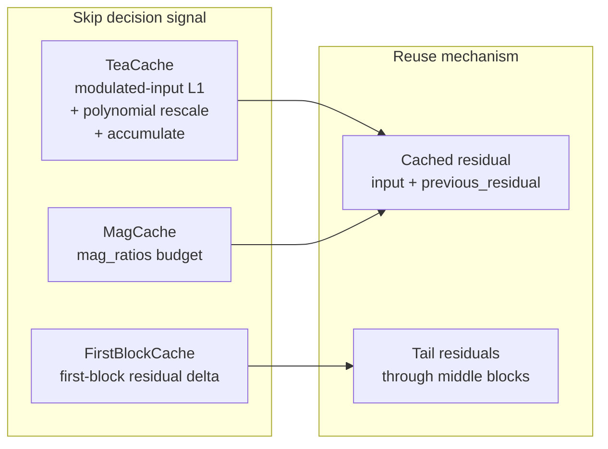

# Ideation: TeaCache for diffusers

**Recommendation:** Ship **FLUX-only TeaCache** using the existing **MagCache block-hook scaffold** (`src/diffusers/hooks/mag_cache.py`), wired through `CacheMixin.enable_cache()`. Add other architectures incrementally as copy-paste blocks with model-specific polynomial coefficients — do not land the full four-model monolith from PR #12652 as-is.

**Source issue:** [#12589 — implement TeaCache](https://github.com/huggingface/diffusers/issues/12589) (3 upvotes, on roadmap, contributions-welcome)

**In-flight work:** [PR #12652](https://github.com/huggingface/diffusers/pull/12652) (open, ~1085 lines, FLUX/Mochi/Lumina2/CogVideoX; maintainer feedback pending)

## Grounding Context

### Codebase Context

Diffusers already ships several training-free inference caches under `src/diffusers/hooks/`, all reachable via `CacheMixin.enable_cache()` in `src/diffusers/models/cache_utils.py`:

| Technique | File | Skip signal | What gets reused |
|-----------|------|-------------|------------------|
| FirstBlockCache | `first_block_cache.py` | First-block output residual delta (absmean ratio) | Tail-block residuals replayed through middle blocks |
| MagCache | `mag_cache.py` | Precomputed `mag_ratios` + accumulated ratio error | Full-stack residual at head (`input + previous_residual`) |
| FasterCache | `faster_cache.py` | Timestep-indexed attention approximation | Cached attention states (CFG-aware denoiser hook) |
| TaylorSeer | `taylorseer_cache.py` | Fixed cache interval + Taylor expansion | Predicted module outputs |

**FirstBlockCache explicitly cites TeaCache** as inspiration but implements a simpler, model-agnostic heuristic:

```199:200:src/diffusers/hooks/first_block_cache.py
    First Block Cache builds on the ideas of [TeaCache](https://huggingface.co/papers/2411.19108). It is much simpler
    to implement generically for a wide range of models and has been integrated first for experimental purposes.
```

**MagCache** is the closest structural prior art: head/tail block hooks, `TransformerBlockRegistry` for block I/O, `StateManager` for cross-step state, and model-specific constants (`FLUX_MAG_RATIOS` in `mag_cache.py:35-66`).

**TeaCache algorithm delta (paper / issue):** extract timestep-modulated input from the first transformer block, compute relative L1 distance vs the previous step, apply model-specific polynomial rescaling, accumulate across steps, and skip full forward when accumulated distance < threshold — reusing cached residuals instead.

**Issue thread consensus:**
- Hooks-based integration (like FasterCache), not monkey-patching model code
- Prototype on **FLUX first** (sayakpaul); contributor opened PR #12652
- Maintainer DN6: prefer **standalone forward functions** keyed by class name in a `_MODEL_CONFIG` map, utility functions for cache state — avoid adapter indirection

**Test precedent:** `tests/hooks/test_mag_cache.py` (dummy transformer + `TransformerBlockRegistry`, skip vs compute assertions) and `tests/models/testing_utils/cache.py` (`MagCacheTesterMixin` for pipeline integration).

## Topic Axes

1. **Hook placement** — block-level head/tail hooks (MagCache/FBC pattern) vs transformer-root forward interception (PR #12652 approach)
2. **Model scope** — FLUX-only MVP vs multi-model day one
3. **Algorithm fidelity** — true TeaCache metric (polynomial-rescaled modulated-input L1) vs extending existing caches
4. **Landing path** — finish PR #12652 vs fresh minimal PR vs docs-only deferral
5. **Validation** — unit hook tests vs pipeline speed/quality benchmarks against paper claims (1.5–2.6×)

### How existing caches relate to TeaCache



TeaCache shares **reuse shape** with MagCache but **decision logic** is distinct — a wrapper merging the two would hide unlike policies.

## Ranked Ideas

Jump list: [1. FLUX-only via MagCache scaffold](#1-flux-only-teacache-via-mag_cache-block-hook-pattern-recommended) · [2. Revise PR #12652 FLUX slice](#2-revise-and-land-pr-12652--flux-slice-only) · [3. Extend FirstBlockCache](#3-add-teacache-metric-to-firstblockcache-as-opt-in-mode) · [4. Unblock #12652 with benchmark gate](#4-unblock-pr-12652-with-maintainer-pairing--benchmark-gate) · [5. Document cache relationships](#5-document-teacache-relationship-in-cache-docs--ship-flux-example)

### 1. FLUX-only TeaCache via `mag_cache` block-hook pattern *(recommended)*

**Description:** Add `TeaCacheConfig` + `apply_teacache()` in a new self-contained `src/diffusers/hooks/teacache.py` (~300–400 lines for v1). Copy the head/tail hook skeleton from `mag_cache.py` (lines 171–441): walk `_ALL_TRANSFORMER_BLOCK_IDENTIFIERS`, register head hook for skip decision + residual replay, middle/tail hooks for pass-through or residual capture. Replace MagCache's ratio-budget logic with TeaCache's polynomial-rescaled modulated-input L1 accumulator. Ship FLUX polynomial coefficients and a FLUX modulated-input extractor only; raise `ValueError` for unsupported model classes.

**Axis:** Hook placement · Model scope · Algorithm fidelity

**Basis:** `direct:` `mag_cache.py:171-280` (head skip + residual replay), `first_block_cache.py:199-200` (TeaCache lineage), `cache_utils.py:39-102` (`enable_cache` dispatch pattern); `external:` DN6 review on PR #12652 (standalone functions, class-name map)

**Rationale:** Matches diffusers' single-file hook convention, keeps model forwards in model files (not copied into hooks), delivers the real TeaCache algorithm for the maintainer-preferred prototype model, and leaves a clear incremental path to add CogVideoX/Wan/etc. as separate copy-paste coefficient blocks.

**Downsides:** Only FLUX on day one; still requires a FLUX-specific modulated-input extraction path (cannot be fully model-agnostic).

**Confidence:** 85%

**Complexity:** Medium

### 2. Revise and land PR #12652 — FLUX slice only

**Description:** Take the existing contributor PR (#12652, +1085 lines, tests in `tests/hooks/test_teacache.py`), strip Mochi/Lumina2/CogVideoX paths, apply DN6's refactor (standalone utility functions, `_MODEL_CONFIG` keyed by class name, no adapter indirection), and merge FLUX + tests. Defer additional models to follow-up PRs.

**Axis:** Landing path

**Basis:** `external:` PR #12652 file list (`hooks/teacache.py`, `tests/hooks/test_teacache.py`, `cache_utils.py` wiring); issue comment — "prototype on flux first" (sayakpaul)

**Rationale:** Fastest path to close #12589 if the contributor remains active; reuses months of iteration including bugfixes (CogVideoX fallback, `torch.compile`, state management).

**Downsides:** Large diff to review; risk that refactor is shallow and full `FluxTransformer2DModel.forward()` copies remain in the hook layer — the main philosophy objection to landing as-is.

**Confidence:** 70%

**Complexity:** Medium–High

### 3. Add TeaCache metric to FirstBlockCache as opt-in mode

**Description:** Extend `FirstBlockCacheConfig` with an optional TeaCache mode: when enabled, the head hook compares polynomial-rescaled modulated-input L1 instead of raw residual absmean. Models register an extractor callback alongside existing `TransformerBlockRegistry` metadata.

**Axis:** Algorithm fidelity · Hook placement

**Basis:** `direct:` `first_block_cache.py:133-142` (residual comparison hook point), `first_block_cache.py:199-200` (already TeaCache-inspired)

**Rationale:** One cache API surface; reuses the generic block-walk that already works across many `CacheMixin` transformers.

**Downsides:** Blurs FirstBlockCache vs TeaCache semantics in one config; still needs per-model extractors for true fidelity; increases complexity of an intentionally simple cache.

**Confidence:** 60%

**Complexity:** Medium

### 4. Unblock PR #12652 with maintainer pairing + benchmark gate

**Description:** Treat #12589 as a coordination task: assign a maintainer co-reviewer, define a FLUX benchmark table (steps, threshold, speedup vs quality metric), and merge #12652 once it passes. No greenfield implementation.

**Axis:** Landing path · Validation

**Basis:** `external:` issue body — "propose a design first in this thread"; PR open since Nov 2025 with design feedback but no merge

**Rationale:** Respects contributor investment; converts stale issue into an actionable review queue item with measurable acceptance criteria.

**Downsides:** Process-only — depends on maintainer bandwidth; does not resolve architectural concerns if review stalls again.

**Confidence:** 75%

**Complexity:** Low (coordination)

### 5. Document TeaCache relationship in cache docs + ship FLUX example

**Description:** Update `docs/source/en/optimization/cache.md` (and cross-links from `CacheMixin` docstring) to explain when to use FirstBlockCache vs MagCache vs TeaCache, with a FLUX `enable_cache(TeaCacheConfig(...))` example. Pair with whichever implementation option (1 or 2) ships code.

**Axis:** Validation · Landing path

**Basis:** `direct:` `cache_utils.py:27-31` (supported techniques list); existing cache optimization docs referenced in issue body

**Rationale:** Users searching for "TeaCache" need a named entry point; docs clarify that FBC is TeaCache-*inspired* but not TeaCache-identical.

**Downsides:** Documentation alone does not close #12589.

**Confidence:** 90%

**Complexity:** Low

## Rejection Summary

| # | Idea | Reason Rejected |
|---|------|-----------------|
| 1 | Land PR #12652 as-is (4 models) | ~1085-line monolith with copied transformer forwards in hook layer; violates single-file/self-contained philosophy |
| 2 | TeaCache wrapper delegating to MagCache | Different skip algorithms (polynomial L1 vs mag-ratio budget); magic facade hides unlike policies |
| 3 | Close issue — FBC/MagCache sufficient | Under-delivers on named TeaCache request and `roadmap` label |
| 4 | `hooks/teacache/` subdirectory package | Extra structure vs established flat `hooks/*.py` convention |
| 5 | External TeaCache package only | Misses `CacheMixin.enable_cache()` integration users expect |
| 6 | Modular-pipeline-only TeaCache | Narrow surface; standard pipeline users left out |
| 7 | FasterCache denoiser-hook clone | FasterCache targets CFG/uncond branch skip, not TeaCache residual metric |
| 8 | Multi-model day-one in fresh PR | High review cost; maintainers asked for agnostic *structure*, not four models at once |
| 9 | CogVideoX-first prototype | Maintainers preferred FLUX (original repo results + popularity) |
| 10 | Auto-detect all CacheMixin models | Too magic; each architecture needs explicit polynomial coefficients |
| - | axis: Hook placement — root forward only | Block hooks are the established pattern in `mag_cache.py`; root-forward copies belong in model files, not hooks |
