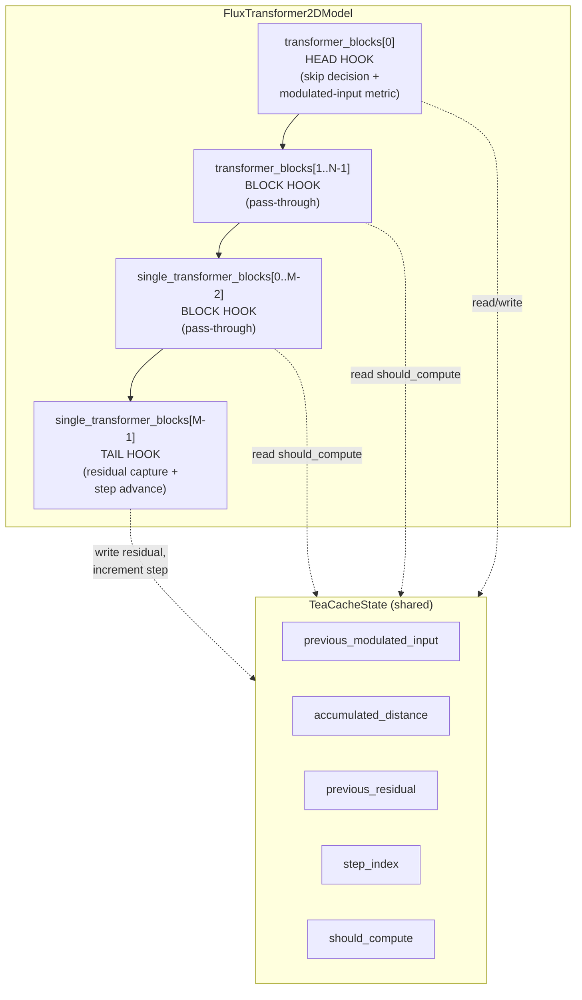

# FLUX-only TeaCache via MagCache block-hook scaffold

## Redundancy Verdict

**Ship a new `src/diffusers/hooks/teacache.py`.** TeaCache does not exist in the repo today. The closest structural prior is `mag_cache.py` (head/tail block hooks, full-stack residual replay via `input + previous_residual`), but MagCache uses a `mag_ratios` budget — not the TeaCache skip metric. `FirstBlockCache` cites TeaCache as inspiration yet implements a model-agnostic first-block residual-delta heuristic; it is not algorithmically equivalent. [PR #12652](https://github.com/huggingface/diffusers/pull/12652) adds four models via transformer-root forward interception and is not merged; it conflicts with maintainer guidance to keep model forwards in model files and use standalone hook utilities keyed by class name. No existing cache can be extended or wrapped without hiding unlike skip policies. The correct change is a fresh, FLUX-only hook module borrowing MagCache's registration topology only.

## Summary

Add a named **TeaCache** inference cache for **FLUX** transformers as a self-contained hook module (`hooks/teacache.py`) that follows the MagCache head/tail block-hook scaffold but implements the paper-faithful skip metric: polynomial-rescaled relative L1 distance on timestep-modulated block input, accumulated across denoising steps, with full-stack residual replay on skip. Wire `TeaCacheConfig` and `apply_teacache()` through `CacheMixin.enable_cache()` / `disable_cache()`, register in the public API, and validate with eight fast unit hook tests plus `TestFluxTransformerTeaCache` integration tests via a new `TeaCacheTesterMixin`. This closes [#12589](https://github.com/huggingface/diffusers/issues/12589).

## Problem Frame

Diffusers ships several training-free inference caches (`FirstBlockCache`, `MagCache`, `FasterCache`, TaylorSeer) under `CacheMixin.enable_cache()`, but TeaCache — the technique from [2411.19108](https://huggingface.co/papers/2411.19108) — is not yet available as a first-class, named cache. Issue #12589 requests TeaCache integration; users who want TeaCache's modulated-input skip policy on FLUX today have no supported path in diffusers.

## Requirements

R1. Export `TeaCacheConfig` and `apply_teacache` from the diffusers public API (`src/diffusers/hooks/__init__.py` and top-level `src/diffusers/__init__.py`), matching the registration pattern used for `MagCacheConfig` / `apply_mag_cache`.

R2. `CacheMixin.enable_cache()` accepts `TeaCacheConfig` and dispatches to `apply_teacache`; `disable_cache()` removes TeaCache hooks (`_TEACACHE_LEADER_BLOCK_HOOK`, `_TEACACHE_BLOCK_HOOK`) and clears `_cache_config`. Double-enable raises the same `ValueError` as other caches.

R3. v1 supports **FLUX only**: `_MODEL_CONFIG` maps `FluxTransformer2DModel` to FLUX polynomial coefficients and a modulated-input extractor. Any other model class passed to `apply_teacache` raises `ValueError` with a clear unsupported-model message.

R4. Skip decision implements **true TeaCache metric**: at each step, extract modulated input at the head block; compute relative L1 distance vs the previous step; apply model-specific polynomial rescaling; accumulate across steps; skip when accumulated distance is below `TeaCacheConfig.rel_l1_thresh`. This logic must not reuse MagCache `mag_ratios` or FirstBlockCache residual-delta heuristics.

R5. On skip, the head hook replays the cached full-stack residual as **`output = input + previous_residual`**, including MagCache-compatible handling for shape mismatches (text+image concatenation) and tuple return paths via `TransformerBlockRegistry`.

R6. Hook registration walks **`_ALL_TRANSFORMER_BLOCK_IDENTIFIERS`**, covering both `transformer_blocks` and `single_transformer_blocks` on FLUX. Head hook on the first block in combined walk order; tail hook on the last block; pass-through block hooks on middle blocks — same topology as `apply_mag_cache`.

R7. Unit tests in `tests/hooks/test_teacache.py` mirror `tests/hooks/test_mag_cache.py`: dummy transformer with registered blocks; assertions for skip vs compute paths; tuple Flux-style I/O; step reset at end of inference loop; hook re-application idempotency; unsupported-model `ValueError`.

R8. Model integration test **`TestFluxTransformerTeaCache`** in `tests/models/transformers/test_models_transformer_flux.py`, using **`TeaCacheTesterMixin`** in `tests/models/testing_utils/cache.py` (parallel to `MagCacheTesterMixin`): enable/disable state, hook registration, inference smoke, context manager, stateful reset.

R9. Documentation updates distinguish TeaCache from FirstBlockCache and MagCache: `docs/source/en/optimization/cache.md` optimization guide with FLUX `enable_cache(TeaCacheConfig(...))` example; `docs/source/en/api/cache.md` autodoc entries for `TeaCacheConfig` and `apply_teacache`.

## Key Technical Decisions

- **Block hooks from `mag_cache.py:171-468`, NOT copied forwards from PR #12652:** Structural prior is MagCache head/tail hook scaffold and `apply_*` registration walk; skip logic and state fields are TeaCache-specific. No transformer-root forward interception.

- **No `# Copied from` header:** Structure is borrowed from MagCache; skip metric, state, and config diverge enough that a copy chain would drift immediately. Fresh file without verbatim copy headers.

- **`_MODEL_CONFIG` keyed by `FluxTransformer2DModel` root class; `TransformerBlockRegistry` only for block I/O metadata:** Per-model polynomial coefficients and modulated-input extractor live in `_MODEL_CONFIG` keyed on the transformer root class. Block hooks resolve I/O shape via registry metadata on block classes — no adapter indirection.

- **Lazy import `FluxTransformerBlock` inside `apply_teacache` — no top-level `transformer_flux` import:** The FLUX modulated-input extractor calls `FluxTransformerBlock.norm1(hidden_states, emb=temb)` at the head block (`transformer_flux.py:445`). Import the block class inside `apply_teacache` (or the extractor closure) to avoid circular imports and keep the hook module self-contained.

- **True TeaCache metric with upstream boundary policy:** First step (`cnt == 0`) and last step (`cnt == num_inference_steps - 1`) always compute. On compute paths, reset the accumulator. Exact formula: `accumulated += poly((|curr - prev| / |prev|).mean())` where `poly` evaluates the model-specific coefficient list. Skip when `accumulated < rel_l1_thresh` and `previous_residual` is set.

- **`FLUX_TEACACHE_COEFFICIENTS` vendored from TeaCache4FLUX:** `[498.651651, -283.781631, 55.8554382, -3.82021401, 0.264230861]` — fifth-degree polynomial rescaling for FLUX Dev/Schnell.

- **Default `rel_l1_thresh=0.4`, `num_inference_steps=28`:** Matches upstream TeaCache4FLUX defaults and standard FLUX pipeline step count.

- **`TeaCacheTesterMixin` uses `num_inference_steps=4` (NOT 2 like MagCache):** TeaCache always computes on first and last steps, so a two-step config leaves no interior step to exercise skip behavior in `_test_cache_inference`. Four steps yields two interior steps where skip can occur.

- **Unit tests: hook logic tests may use direct hook registration OR a test-only modulated-input extractor; separate `test_apply_teacache_unsupported_model` for `ValueError`:** Dummy blocks in hook tests do not have real `norm1`; register a test-only extractor in `_MODEL_CONFIG` for dummy model classes OR exercise hooks via direct registration. Unsupported-model coverage is a dedicated test calling `apply_teacache` on a non-FLUX dummy — distinct from hook-behavior tests (R-7 vs AE-1 split).

- **Registration checklist:** `hooks/__init__.py`, `diffusers/__init__.py` (two places each: `_import_structure` + `TYPE_CHECKING`), `cache_utils.py` enable/disable dispatch, `CacheMixin` docstring supported-techniques list, then `make fix-copies` to regenerate `dummy_pt_objects.py`.

## High-Level Technical Design

### Hook topology on FLUX dual block lists

`apply_teacache` walks `module.named_children()` in definition order, collecting blocks from `_ALL_TRANSFORMER_BLOCK_IDENTIFIERS` module lists. On `FluxTransformer2DModel`, this yields `transformer_blocks[0..N-1]` followed by `single_transformer_blocks[0..M-1]`. The head hook attaches to the first block in this combined list; the tail hook attaches to the last; middle blocks get pass-through block hooks that either forward unchanged (skip path) or run the original forward (compute path) and defer residual capture to the tail.

### Skip decision flow (head hook)

At each denoising step, the head hook:

1. Ensures inference `StateManager` context is active.
2. Captures block `hidden_states` input via `TransformerBlockRegistry` metadata.
3. Extracts FLUX modulated input from the head block (`norm1(hidden_states, emb=temb)`).
4. If `step_index == 0` or `step_index == num_inference_steps - 1`, forces compute and resets accumulator.
5. Otherwise, if previous modulated input exists: compute relative L1 distance, polynomial-rescale, accumulate.
6. If `accumulated < rel_l1_thresh` and `previous_residual` is set, set `should_compute = False` and return `input + previous_residual` (with tuple/shape handling).
7. Otherwise reset accumulator, set `should_compute = True`, run original block forward.

The tail hook on compute path captures `residual = out_hidden - in_hidden`, stores `previous_residual`, stores current modulated input for next step, and advances `step_index`. On skip path, middle/tail hooks pass through inputs unchanged; tail still advances `step_index`.

### Enable / disable lifecycle

1. User calls `model.enable_cache(TeaCacheConfig(...))` on a `CacheMixin` model.
2. `cache_utils.py` dispatches to `apply_teacache(model, config)`.
3. `apply_teacache` validates model class against `_MODEL_CONFIG`, walks block lists, registers hooks (same walk as `apply_mag_cache`, `mag_cache.py:397-468`).
4. `disable_cache()` removes `_TEACACHE_LEADER_BLOCK_HOOK` and `_TEACACHE_BLOCK_HOOK` by name (`recurse=True`) and clears `_cache_config`.

## Implementation Units

U1. **Create `src/diffusers/hooks/teacache.py`** — `TeaCacheConfig` (defaults: `rel_l1_thresh=0.4`, `num_inference_steps=28`), `TeaCacheState`, `TeaCacheHeadHook`, `TeaCacheBlockHook`, `FLUX_TEACACHE_COEFFICIENTS`, `_MODEL_CONFIG` keyed on `FluxTransformer2DModel`, `_TEACACHE_LEADER_BLOCK_HOOK` / `_TEACACHE_BLOCK_HOOK` constants, `apply_teacache` with lazy `FluxTransformerBlock` import for the modulated-input extractor, polynomial evaluation helper, and boundary-step always-compute logic.

U2. **Wire `src/diffusers/models/cache_utils.py`** — Add `TeaCacheConfig` / `apply_teacache` to `enable_cache` dispatch and `disable_cache` hook removal; update `CacheMixin` docstring supported-techniques list.

U3. **Register exports** — `src/diffusers/hooks/__init__.py` and `src/diffusers/__init__.py` (alphabetical `_import_structure` + `TYPE_CHECKING` in both files); run `make fix-copies` to regenerate `src/diffusers/utils/dummy_pt_objects.py`.

U4. **`tests/hooks/test_teacache.py`** — Eight fast unit tests (see Test Plan below). No `@slow`.

U5. **`TeaCacheConfigMixin` + `TeaCacheTesterMixin` in `tests/models/testing_utils/cache.py`**; export from `tests/models/testing_utils/__init__.py`; add `TestFluxTransformerTeaCache(FluxTransformerTesterConfig, TeaCacheTesterMixin)` in `tests/models/transformers/test_models_transformer_flux.py`.

U6. **Docs** — `docs/source/en/optimization/cache.md` (TeaCache section + comparison table vs FirstBlockCache/MagCache); `docs/source/en/api/cache.md` (autodoc for `TeaCacheConfig`, `apply_teacache`, `FLUX_TEACACHE_COEFFICIENTS`).

### Test Plan

#### Hook unit tests (`tests/hooks/test_teacache.py`) — 8 fast tests

| # | Test name | What it asserts |
|---|-----------|-----------------|
| 1 | `test_apply_teacache_unsupported_model` | `apply_teacache()` on a dummy model class not in `_MODEL_CONFIG` raises `ValueError` naming the unsupported class (AE-1 / R-3). |
| 2 | `test_teacache_skipping_logic` | With a high `rel_l1_thresh`, identical modulated inputs across interior steps, and a dummy block whose forward would mutate output: step 1 computes, step 2 skips and returns `input + previous_residual` without calling block forward (AE-2 / R-4, R-5). |
| 3 | `test_teacache_first_last_always_compute` | With `num_inference_steps=4`, steps 0 and 3 always compute even when accumulated distance would allow skip; only interior steps 1–2 are eligible (boundary policy KTD). |
| 4 | `test_teacache_tuple_outputs` | Flux-style tuple I/O (`return_hidden_states_index=0`, `return_encoder_hidden_states_index=1`): skip path returns correct tuple with encoder hidden states preserved unchanged (R-5). |
| 5 | `test_teacache_reset` | After `num_inference_steps` forwards, `step_index` resets to 0 and skip state clears; next forward computes fresh (mirrors `test_mag_cache_reset`). |
| 6 | `test_teacache_hook_reapplication` | Calling `apply_teacache` twice on the same model replaces existing hooks without duplicate registration or stale state. |
| 7 | `test_teacache_accumulator_reset_on_compute` | When accumulated distance exceeds threshold (or no `previous_residual`), accumulator resets to 0 and block forward runs; subsequent step starts fresh accumulation. |
| 8 | `test_teacache_polynomial_rescaling` | Controlled modulated-input delta produces expected accumulated value after polynomial evaluation (verifies coefficient application, not just threshold gate). |

Hook tests use dummy transformers with `TransformerBlockRegistry` registration (same fixture pattern as `test_mag_cache.py`). Modulated-input extraction in tests uses a test-only extractor registered for dummy block classes (direct hook registration is also acceptable for isolated head/tail behavior tests).

#### Model integration tests (`TestFluxTransformerTeaCache`) — 6 mixin tests

| # | Test name | What it asserts |
|---|-----------|-----------------|
| 1 | `test_teacache_enable_disable_state` | `is_cache_enabled` toggles correctly through enable/disable. |
| 2 | `test_teacache_double_enable_raises_error` | Second `enable_cache(TeaCacheConfig(...))` raises `ValueError` matching existing caches. |
| 3 | `test_teacache_hooks_registered` | `_TEACACHE_LEADER_BLOCK_HOOK` and/or `_TEACACHE_BLOCK_HOOK` present after enable; absent after disable. |
| 4 | `test_teacache_inference` | Two-pass inference with varied `hidden_states` completes without NaN; cached second pass differs from non-cached run (smoke correctness). Uses `num_inference_steps=4` config. |
| 5 | `test_teacache_context_manager` | `model.cache_context(...)` sets hook context; forward succeeds inside context. |
| 6 | `test_teacache_reset_stateful_cache` | `_reset_stateful_cache()` clears cross-step state between inference runs. |

All mixin tests carry `@is_cache` / `pytest -m "not cache"` skip marker. Fast only — no `@slow`.

## Scope Boundaries

**Deferred for later (not v1):**

- Multi-model TeaCache (Mochi, Lumina2, CogVideoX, Wan) as incremental `_MODEL_CONFIG` entries.
- FLUX-Kontext coefficient variant — defer; shared FLUX coefficients for v1.
- Pipeline-level `TeaCacheTesterMixin` on `tests/pipelines/flux/test_pipeline_flux.py` — follow-up, not v1.
- Speed/quality benchmarks against paper claims (1.5–2.6×); v1 validates correctness, not performance SLAs.

**Outside this change:**

- Landing PR #12652 as-is.
- Extending `FirstBlockCache` with a TeaCache mode.
- A TeaCache wrapper delegating skip logic to MagCache.
- `hooks/teacache/` subpackage.

## System-Wide Impact

**Public API:** Additive — `TeaCacheConfig`, `apply_teacache`, `FLUX_TEACACHE_COEFFICIENTS`. No deprecations.

**`# Copied from`:** None introduced; no existing copy chains invalidated.

**Estimated diff:** ~650–850 LOC across hook module, tests, registration, and docs.

**Performance posture:** Skipping reduces compute on interior denoising steps; head hook pays an extra `norm1` call on compute paths (double norm1 — acceptable perf cost documented in Risks). ControlNet and IP-Adapter residual injection paths are not intercepted by block hooks and remain out-of-scope for v1.

## Risks & Dependencies

| Risk | Mitigation |
|------|------------|
| ControlNet / IP-Adapter residuals skipped on cache replay | Document as out-of-scope v1; block hooks operate below controlnet injection in the forward walk — cached full-stack residual may not include controlnet deltas. Users combining TeaCache with ControlNet should expect undefined behavior until a follow-up. |
| Double `norm1` on compute path | Head hook calls `norm1` for modulated-input extraction before the block forward also runs `norm1` internally. Acceptable perf cost for v1; note in docs. |
| R-7 vs AE-1 test split | Hook-behavior tests (R-7) use dummy models with test extractors; unsupported-model test (AE-1) is a separate `test_apply_teacache_unsupported_model` — do not conflate. |
| Hook infrastructure stability | Depends on existing `HookRegistry`, `StateManager`, `TransformerBlockRegistry`, `_ALL_TRANSFORMER_BLOCK_IDENTIFIERS` remaining stable — no pipeline changes required for transformer-level enablement. |
| `FluxTransformer2DModel` mixes in `CacheMixin` | Already true (same integration target as MagCache). |

## Acceptance Examples

AE1. (`R3`) When `apply_teacache()` is called on a model class not in `_MODEL_CONFIG` (e.g. a dummy transformer in tests), it raises `ValueError` naming the unsupported class.

AE2. (`R4`, `R5`) When accumulated polynomial-rescaled modulated-input distance is below `rel_l1_thresh` and `previous_residual` is set on an interior step, the head hook returns `input + previous_residual` without invoking the block's original forward (verified by a dummy block whose forward would mutate output if called).

AE3. (`R2`) When `disable_cache()` is called after `enable_cache(TeaCacheConfig(...))`, TeaCache leader and block hooks are removed from the hook registry (`recurse=True`), `_cache_config` is cleared, and a subsequent forward pass runs without skip behavior.

AE4. (`R4`) When `step_index == 0` or `step_index == num_inference_steps - 1`, the head hook always computes regardless of accumulated distance.

## Documentation / Operational Notes

- `docs/source/en/optimization/cache.md`: Add TeaCache section with FLUX example (`enable_cache(TeaCacheConfig(rel_l1_thresh=0.4, num_inference_steps=28))`), comparison table distinguishing TeaCache (modulated-input L1 + polynomial accumulate) from FirstBlockCache (first-block residual delta) and MagCache (`mag_ratios` budget, same residual replay shape).
- `docs/source/en/api/cache.md`: Add `[[autodoc]]` entries for `TeaCacheConfig`, `apply_teacache`.
- Pre-PR: run `make style`, `make fix-copies`, fast pytest slice on touched test files.

## Open Questions

All items deferred from the brainstorm requirements doc are resolved for v1:

| Question | Resolution |
|----------|------------|
| FLUX-Kontext coefficient variant | Defer; use shared `FLUX_TEACACHE_COEFFICIENTS` for all FLUX variants in v1. |
| Pipeline-level `TeaCacheTesterMixin` | Follow-up, not v1; model-level `TestFluxTransformerTeaCache` is sufficient. |
| Exact polynomial coefficients and defaults | Vendored from TeaCache4FLUX: `[498.651651, -283.781631, 55.8554382, -3.82021401, 0.264230861]`; defaults `rel_l1_thresh=0.4`, `num_inference_steps=28`. |

## Sources / Research

| Source | Role |
|--------|------|
| `docs/brainstorms/2026-06-23-teacache-requirements.md` | Upstream requirements (R-1 through R-9, acceptance examples) |
| `docs/ideation/2026-06-23-teacache.md` | Chosen option (#1 FLUX-only MagCache scaffold), ranked alternatives |
| `src/diffusers/hooks/mag_cache.py:29-30` | Hook name constants pattern |
| `src/diffusers/hooks/mag_cache.py:140-168` | State class shape (adapt for TeaCache fields) |
| `src/diffusers/hooks/mag_cache.py:171-284` | Head hook scaffold (residual replay, tuple I/O) |
| `src/diffusers/hooks/mag_cache.py:287-394` | Block/tail hook scaffold (pass-through, residual capture, step advance) |
| `src/diffusers/hooks/mag_cache.py:397-468` | `apply_mag_cache` registration walk |
| `src/diffusers/models/cache_utils.py:39-147` | `enable_cache` / `disable_cache` dispatch pattern |
| `src/diffusers/hooks/first_block_cache.py:199-200` | TeaCache lineage note (distinct from FBC heuristic) |
| `src/diffusers/models/transformers/transformer_flux.py:445` | FLUX modulated-input extraction point (`norm1` + `temb`) |
| `src/diffusers/models/transformers/transformer_flux.py:608-619` | Dual block lists (`transformer_blocks`, `single_transformer_blocks`) |
| `src/diffusers/hooks/_common.py:24-40` | `_ALL_TRANSFORMER_BLOCK_IDENTIFIERS` |
| `tests/hooks/test_mag_cache.py` | Unit test precedent |
| `tests/models/testing_utils/cache.py:567-631` | `MagCacheTesterMixin` pattern |
| `tests/models/transformers/test_models_transformer_flux.py:526-527` | `TestFluxTransformerMagCache` placement |
| [Issue #12589](https://github.com/huggingface/diffusers/issues/12589) | User request |
| [PR #12652](https://github.com/huggingface/diffusers/pull/12652) | External reference — not merged; informs non-goals |
| [TeaCache paper 2411.19108](https://huggingface.co/papers/2411.19108) | Algorithm definition |
| TeaCache4FLUX upstream | FLUX polynomial coefficients source |
